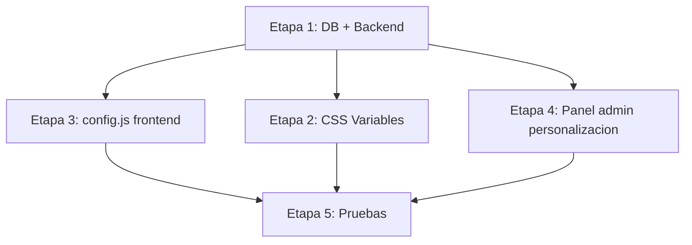

# FASE 1 — Personalización de Tienda (Plan Técnico)

## Índice

1. [Arquitectura Propuesta](#1-arquitectura-propuesta)
2. [Estructura SQLite](#2-estructura-sqlite)
3. [Endpoints Necesarios](#3-endpoints-necesarios)
4. [Cambios Frontend](#4-cambios-frontend)
5. [Panel Admin — Sección Personalización](#5-panel-admin--secci%C3%B3n-personalizaci%C3%B3n)
6. [Plan de Implementación](#6-plan-de-implementaci%C3%B3n)
7. [Riesgos y Precauciones](#7-riesgos-y-precauci%C3%B3n)
8. [Escalabilidad Futura](#8-escalabilidad-futura)

---

## 1. ARQUITECTURA PROPUESTA

### 1.1 Modelo de Configuración Global

Se implementará un patrón **key-value persistente** con una tabla SQLite genérica `configuracion`. Cada clave representa un aspecto configurable de la tienda.

**¿Por qué key-value y no columnas fijas?**

| Enfoque | Ventaja |
|---------|---------|
| **Key-Value** | No requiere migraciones al agregar nuevas configuraciones. Escalable. Fácil de extender en Fase 2+. |
| **Columnas fijas** | Requiere ALTER TABLE cada vez que se agrega una opción. Frágil. |

### 1.2 Flujo de carga de configuración

```
[Server start]
    ↓
db.js crea tabla configuracion si no existe (better-sqlite3)
    ↓
server.js monta rutas /api/config
    ↓
GET /api/config → devuelve JSON con toda la config
    ↓
Frontend (config.js) hace fetch a /api/config al cargar
    ↓
Aplica: logo, nombre, colores CSS variables, hero, WhatsApp, redes, categorias
```

### 1.3 Como se aplica en frontend SIN romper el HTML actual

- **Logo**: Se inyecta en `.logo` mediante JS (no se toca el HTML estatico).
- **Nombre tienda**: Se reemplaza texto en `.logo`, `<title>` y footer.
- **Colores**: Se setean como CSS custom properties (`--color-primario`, `--color-secundario`) en `:root` via JS. El CSS actual se adapta automaticamente.
- **Hero**: Se modifica contenido del `.hero-content` (titulo, descripcion) y fondo.
- **Categorias**: La seccion `<section class="categorias">` se renderiza DINAMICAMENTE desde JS, usando los datos de `GET /categorias`. Se elimina el HTML hardcodeado.
- **Redes sociales**: Los iconos del footer se renderizan DINAMICAMENTE desde JS, usando las URLs configuradas en la tabla `configuracion`. Se elimina el HTML hardcodeado de los SVGs.
- **WhatsApp**: Boton flotante si esta habilitado, con numero y mensaje configurado.
- **Contacto**: Datos en footer si estan configurados.

### 1.4 Estrategia de compatibilidad

- **No se elimina ni modifica ningun ID, clase o funcion existente** (excepto el HTML hardcodeado de categorias y redes que se reemplaza por renderizado dinamico).
- Las configuraciones tienen valores por defecto hardcodeados en el frontend como fallback.
- Si `GET /api/config` falla, la tienda sigue funcionando con valores por defecto.
- Los cambios son **puramente aditivos**: se agregan archivos nuevos, se modifican los existentes solo para agregar llamadas a la nueva funcionalidad.

---

## 2. ESTRUCTURA SQLITE (better-sqlite3)

### 2.1 Nueva tabla: `configuracion`

```sql
CREATE TABLE IF NOT EXISTS configuracion (
    clave TEXT PRIMARY KEY,
    valor TEXT NOT NULL,
    tipo TEXT DEFAULT 'texto',
    grupo TEXT DEFAULT 'general'
);
```

**Justificacion de cada columna:**

| Columna | Motivo |
|---------|--------|
| `clave` TEXT PK | Identificador unico legible (`tienda_nombre`, `hero_titulo`). Sin AUTOINCREMENT porque las claves son semanticas. |
| `valor` TEXT | Almacena cualquier tipo serializado como string. Para booleanos: `"true"`/`"false"`. Para colores: `"#2563eb"`. Para imagenes: ruta relativa `/uploads/logo.png`. |
| `tipo` TEXT | Ayuda al panel admin a renderizar el input correcto (color picker, file upload, text, number, switch). |
| `grupo` TEXT | Agrupa configuraciones en el panel admin por secciones (pestanas o acordeones). |

### 2.2 Indices

No se necesitan indices adicionales. La PK `clave` ya es unica y las consultas son siempre `SELECT valor FROM configuracion WHERE clave = ?`.

### 2.3 Datos semilla (configuracion por defecto)

Se insertan al crear la tabla si esta vacia, usando la API de better-sqlite3:

```js
// En database/db.js
db.exec(`
    CREATE TABLE IF NOT EXISTS configuracion (
        clave TEXT PRIMARY KEY,
        valor TEXT NOT NULL,
        tipo TEXT DEFAULT 'texto',
        grupo TEXT DEFAULT 'general'
    )
`);

const configCount = db.prepare('SELECT COUNT(*) as total FROM configuracion').get();
if (configCount.total === 0) {
    const insert = db.prepare('INSERT INTO configuracion (clave, valor, tipo, grupo) VALUES (?, ?, ?, ?)');
    
    const defaults = [
        // GENERAL
        ['tienda_nombre', 'Mi Shop', 'texto', 'general'],
        ['tienda_descripcion', 'Moda, estilo y tecnologia para tu dia a dia.', 'texto', 'general'],
        
        // APARIENCIA
        ['color_primario', '#000000', 'color', 'apariencia'],
        ['color_secundario', '#444444', 'color', 'apariencia'],
        ['color_fondo', '#f4f4f4', 'color', 'apariencia'],
        ['color_texto', '#111827', 'color', 'apariencia'],
        ['color_boton', '#000000', 'color', 'apariencia'],
        ['color_boton_texto', '#ffffff', 'color', 'apariencia'],
        
        // HERO
        ['hero_titulo', 'Descubri tu proximo estilo', 'texto', 'hero'],
        ['hero_descripcion', 'Productos modernos, elegantes y seleccionados para vos', 'texto', 'hero'],
        ['hero_fondo', 'linear-gradient(135deg, black, #444)', 'texto', 'hero'],
        ['hero_imagen', '', 'imagen', 'hero'],
        
        // WHATSAPP (flotante)
        ['whatsapp_numero', '', 'texto', 'whatsapp'],
        ['whatsapp_mensaje', 'Hola! Quiero consultar por un producto', 'texto', 'whatsapp'],
        ['whatsapp_activo', 'true', 'booleano', 'whatsapp'],
        
        // CONTACTO
        ['contacto_email', '', 'texto', 'contacto'],
        ['contacto_telefono', '', 'texto', 'contacto'],
        ['contacto_direccion', '', 'texto', 'contacto'],
        
        // REDES SOCIALES (URLs completas)
        ['redes_instagram', 'https://instagram.com', 'texto', 'redes'],
        ['redes_facebook', 'https://facebook.com', 'texto', 'redes'],
        ['redes_tiktok', 'https://tiktok.com', 'texto', 'redes'],
        ['redes_whatsapp', 'https://wa.me/5493810000000', 'texto', 'redes'],
        
        // LOGO
        ['logo_imagen', '', 'imagen', 'apariencia'],
    ];
    
    const insertMany = db.transaction((rows) => {
        for (const row of rows) insert.run(...row);
    });
    insertMany(defaults);
}
```

**Nota:** Se usa `db.transaction()` de better-sqlite3 para insertar todos los defaults en una sola transaccion atomica.

### 2.4 Por que NO usar JSON para todo?

Podria almacenarse toda la config como un solo JSON en una fila, pero:

| Enfoque | Problema |
|---------|----------|
| **JSON unico** | Para cambiar 1 valor hay que leer-escribir todo el objeto. Riesgo de corruption. No escalable a muchas claves. |
| **Key-Value** | Cada clave es independiente. Se puede actualizar una sin afectar las demas. Consultas simples y rapidas con better-sqlite3. |

---

## 3. ENDPOINTS NECESARIOS

### 3.1 Nuevo archivo: [`routes/configRoutes.js`](routes/configRoutes.js)

| Metodo | Ruta | Auth | Descripcion | Payload | Respuesta |
|--------|------|------|-------------|---------|-----------|
| `GET` | `/api/config` | No | Obtener TODA la configuracion publica | -- | `{ tienda_nombre: "...", color_primario: "...", ... }` |
| `GET` | `/api/config/admin` | Si | Obtener configuracion + metadatos (tipo, grupo) para el panel admin | -- | `[{ clave, valor, tipo, grupo }, ...]` |
| `PUT` | `/api/config/:clave` | Si | Actualizar una configuracion especifica | `{ valor: "nuevo valor" }` | `{ ok: true }` |
| `POST` | `/api/config/logo` | Si | Subir imagen de logo | `multipart: logo` | `{ url: "/uploads/logo-xxx.png" }` |
| `POST` | `/api/config/hero-imagen` | Si | Subir imagen de hero | `multipart: hero` | `{ url: "/uploads/hero-xxx.png" }` |

### 3.2 Detalle de endpoints

#### `GET /api/config`
- **Proposito**: Usado por el frontend publico al cargar la pagina.
- **Implementacion**: Lee TODAS las filas de `configuracion` y devuelve un objeto plano `{ clave: valor }`.
- **Cache**: Se puede agregar `Cache-Control: public, max-age=300` para reducir carga.

#### `GET /api/config/admin`
- **Proposito**: Usado por el panel de personalizacion para renderizar los inputs.
- **Implementacion**: Devuelve array con todas las filas incluyendo `tipo` y `grupo` para que el frontend admin sepa que input renderizar.

#### `PUT /api/config/:clave`
- **Proposito**: Actualizar un valor individual.
- **Validaciones**:
  - Si `tipo === 'color'`: validar formato hex (`/^#[0-9a-fA-F]{6}$/`).
  - Si `tipo === 'numero'`: validar que sea numerico.
  - Si `tipo === 'booleano'`: aceptar solo `"true"` o `"false"`.
  - Si `tipo === 'imagen'`: validar que sea una ruta existente en `uploads/`.

#### `POST /api/config/logo`
- Usa el middleware `upload.single('logo')` de multer (ya existente en [`middleware/uploadMiddleware.js`](middleware/uploadMiddleware.js)).
- Guarda en `/uploads/` y actualiza automaticamente la clave `logo_imagen`.

### 3.3 Integracion en [`server.js`](server.js)

Se agrega una linea:

```js
const configRoutes = require('./routes/configRoutes');
app.use('/api/config', configRoutes);
```

La ruta publica `GET /api/config` NO requiere autenticacion. Las rutas de escritura SI requieren `authMiddleware`.

---

## 4. CAMBIOS FRONTEND

### 4.1 Archivos a modificar (cambios aditivos minimos)

| Archivo | Cambio |
|---------|--------|
| [`public/index.html`](public/index.html) | Agregar `<script src="/js/config.js"></script>` ANTES de `script.js`. **Reemplazar** las categorias hardcodeadas por `<section class="categorias" id="categorias"></section>`. **Reemplazar** el footer social hardcodeado por `<div class="footer-social" id="footerSocial"></div>`. |
| [`public/carrito.html`](public/carrito.html) | Agregar `<script src="/js/config.js"></script>` ANTES de `carrito.js`. **Reemplazar** el footer social hardcodeado por `<div class="footer-social" id="footerSocial"></div>`. |
| [`public/js/script.js`](public/js/script.js) | Al inicio, llamar a `cargarConfiguracion()` (definida en `config.js`). La funcion `filtrarCategoria()` se mantiene intacta. |
| [`public/js/carrito.js`](public/js/carrito.js) | Al inicio, llamar a `cargarConfiguracion()`. |
| [`public/js/config.js`](public/js/config.js) | **NUEVO ARCHIVO**. Contiene toda la logica de carga y aplicacion de configuracion. |
| [`public/css/store.css`](public/css/store.css) | Reemplazar colores hardcodeados por variables CSS. Agregar estilos para boton WhatsApp flotante. |
| [`public/admin/admin.html`](public/admin/admin.html) | Agregar link a "Personalizacion" en sidebar. |
| [`public/admin/dashboard.html`](public/admin/dashboard.html) | Agregar link a "Personalizacion" en sidebar. |
| [`public/admin/pedidos.html`](public/admin/pedidos.html) | Agregar link a "Personalizacion" en sidebar. |
| [`public/admin/personalizacion.html`](public/admin/personalizacion.html) | **NUEVO ARCHIVO**. Panel de personalizacion. |
| [`public/js/admin.js`](public/js/admin.js) | Agregar funcion `cargarConfigAdmin()` y logica del panel de personalizacion. |
| [`public/css/admin.css`](public/css/admin.css) | Estilos para el panel de personalizacion. |

### 4.2 Nuevo archivo: [`public/js/config.js`](public/js/config.js)

**Responsabilidades:**

1. `cargarConfiguracion()` -- hace fetch a `/api/config`, guarda en variable global `configuracion`.
2. `aplicarConfiguracion()` -- aplica los valores al DOM:
   - **Logo**: Si `logo_imagen` tiene valor, reemplaza el texto del `.logo` por ``.
   - **Nombre**: Actualiza `.logo` text, `<title>` y `.footer-brand h2`.
   - **Descripcion**: Actualiza `.footer-brand p` y hero `<p>`.
   - **Colores**: Setea CSS custom properties en `document.documentElement.style`:
     ```js
     document.documentElement.style.setProperty('--color-primario', config.color_primario);
     document.documentElement.style.setProperty('--color-secundario', config.color_secundario);
     document.documentElement.style.setProperty('--color-fondo', config.color_fondo);
     document.documentElement.style.setProperty('--color-texto', config.color_texto);
     document.documentElement.style.setProperty('--color-boton', config.color_boton);
     document.documentElement.style.setProperty('--color-boton-texto', config.color_boton_texto);
     ```
   - **Hero**: Actualiza `h1`, `p` y fondo del `.hero`.
   - **Categorias**: Renderiza dinamicamente los botones en `#categorias` usando `GET /categorias`.
   - **Redes sociales**: Renderiza dinamicamente los iconos SVG en `#footerSocial` usando las URLs de configuracion.
   - **WhatsApp flotante**: Si `whatsapp_activo === 'true'` y hay numero, agrega boton flotante al body.
   - **Contacto**: Actualiza datos de contacto si existen en el footer.

3. **Fallback**: Si el fetch falla, no hace nada -> la tienda se ve con valores hardcodeados del HTML/CSS actual.

### 4.3 Renderizado dinamico de categorias

En lugar de tener esto hardcodeado en HTML:

```html
<section class="categorias">
    <button onclick="filtrarCategoria(0)">Todos</button>
    <button onclick="filtrarCategoria(1)">Ropa</button>
    <button onclick="filtrarCategoria(2)">Calzado</button>
    <button onclick="filtrarCategoria(3)">Accesorios</button>
</section>
```

Se tendra un contenedor vacio:

```html
<section class="categorias" id="categorias"></section>
```

Y en [`config.js`](public/js/config.js) se renderizara dinamicamente:

```js
async function renderizarCategorias() {
    const contenedor = document.getElementById('categorias');
    if (!contenedor) return;
    
    let html = '<button onclick="filtrarCategoria(0)" class="active">Todos</button>';
    
    try {
        const respuesta = await fetch('/categorias');
        const categorias = await respuesta.json();
        
        categorias.forEach(cat => {
            html += `<button onclick="filtrarCategoria(${cat.id})">${cat.nombre}</button>`;
        });
    } catch(e) {
        console.warn('Error al cargar categorias:', e);
    }
    
    contenedor.innerHTML = html;
}
```

**Por que asi?** La funcion `filtrarCategoria(id)` ya existe y funciona con IDs numericos. No se modifica. Solo se hace dinamica la generacion de los botones.

### 4.4 Renderizado dinamico de redes sociales

En lugar de tener los SVGs hardcodeados en el footer de [`index.html`](public/index.html:194-256) y [`carrito.html`](public/carrito.html:128-190), se tendra:

```html
<div class="footer-social" id="footerSocial"></div>
```

Y en [`config.js`](public/js/config.js):

```js
function renderizarRedes() {
    const contenedor = document.getElementById('footerSocial');
    if (!contenedor) return;
    
    const SVG_INSTAGRAM = '<svg xmlns="http://www.w3.org/2000/svg" width="22" height="22" fill="currentColor" viewBox="0 0 16 16"><path d="M8 0C5.829 0 5.556.01 4.703.048 3.85.088 3.269.222 2.76.42..."/></svg>';
    const SVG_FACEBOOK = '...';
    const SVG_TIKTOK = '...';
    const SVG_WHATSAPP = '...';
    
    const redes = [
        { clave: 'redes_instagram', nombre: 'Instagram', clase: 'instagram', svg: SVG_INSTAGRAM },
        { clave: 'redes_facebook', nombre: 'Facebook', clase: 'facebook', svg: SVG_FACEBOOK },
        { clave: 'redes_tiktok', nombre: 'TikTok', clase: 'tiktok', svg: SVG_TIKTOK },
        { clave: 'redes_whatsapp', nombre: 'WhatsApp', clase: 'whatsapp', svg: SVG_WHATSAPP }
    ];
    
    let html = '';
    redes.forEach(red => {
        const url = configuracion[red.clave];
        if (url && url.trim() !== '') {
            html += `<a href="${url}" target="_blank" class="social-btn ${red.clase}">${red.svg}</a>`;
        }
    });
    
    contenedor.innerHTML = html;
}
```

**Los SVGs se definen como constantes** en `config.js` para no perder los iconos actuales.

### 4.5 Estrategia de colores con CSS Variables

En [`public/css/store.css`](public/css/store.css) se reemplazan colores hardcodeados por variables:

```css
:root {
    --color-primario: #000000;
    --color-secundario: #444444;
    --color-fondo: #f4f4f4;
    --color-texto: #111827;
    --color-boton: #000000;
    --color-boton-texto: #ffffff;
}

body { background: var(--color-fondo); }
.navbar { background: white; }
.hero { background: var(--color-primario); }
.producto button { background: var(--color-boton); color: var(--color-boton-texto); }
```

**Por que no reemplazar TODOS los colores?** Solo se reemplazan los que tiene sentido personalizar. El blanco del navbar se mantiene fijo.

### 4.6 Boton WhatsApp flotante

Se agrega mediante JS. Estilos en [`store.css`](public/css/store.css):

```css
.whatsapp-float {
    position: fixed;
    bottom: 20px;
    right: 20px;
    z-index: 999;
    width: 56px;
    height: 56px;
    background: #25D366;
    border-radius: 50%;
    display: flex;
    align-items: center;
    justify-content: center;
    box-shadow: 0 4px 12px rgba(0,0,0,0.2);
    cursor: pointer;
    transition: transform 0.3s;
}
.whatsapp-float:hover { transform: scale(1.1); }
```

---

## 5. PANEL ADMIN -- SECCION PERSONALIZACION

### 5.1 Nueva pagina: [`public/admin/personalizacion.html`](public/admin/personalizacion.html)

**Layout**: Mismo sidebar que las otras paginas admin. Nuevo link activo "Personalizacion".

### 5.2 UX del panel

El panel se organiza en **tarjetas por grupo** con tabs:

```
+---------------------------------------------+
|  Personalizacion de tienda                  |
+---------------------------------------------+
|  [General] [Apariencia] [Hero] [WhatsApp]   |
|  [Contacto] [Redes]                         |
+---------------------------------------------+
|                                               |
|  +-- GENERAL ------------------------------+ |
|  | Nombre:    [Mi Shop              ]     | |
|  | Descripcion: [_______________     ]     | |
|  | Logo:      [Seleccionar archivo]  img   | |
|  +-----------------------------------------+ |
|                                               |
|  +-- APARIENCIA ---------------------------+ |
|  | Color primario:   [ #000000]            | |
|  | Color secundario: [ #444444]            | |
|  | Color fondo:      [ #f4f4f4]            | |
|  | Color texto:      [ #111827]            | |
|  | Color boton:      [ #000000]            | |
|  | Color texto boton:[ #ffffff]            | |
|  +-----------------------------------------+ |
|                                               |
|  +-- WHATSAPP -----------------------------+ |
|  | Activo:        [Si / No]                | |
|  | Numero:        [5491122334455    ]      | |
|  | Mensaje:       [Hola! Quiero... ]       | |
|  +-----------------------------------------+ |
|                                               |
|  +-- REDES SOCIALES -----------------------+ |
|  | Instagram URL: [https://instagram...]   | |
|  | Facebook URL:  [https://facebook...]    | |
|  | TikTok URL:    [https://tiktok.com...]  | |
|  | WhatsApp URL:  [https://wa.me/549...]   | |
|  +-----------------------------------------+ |
|                                               |
|  [Guardar cambios]                           |
+---------------------------------------------+
```

### 5.3 Inputs por tipo

| `tipo` | Input renderizado |
|--------|-------------------|
| `texto` | `<input type="text">` o `<textarea>` si es largo |
| `color` | `<input type="color">` |
| `imagen` | File input + preview de imagen actual |
| `numero` | `<input type="number">` |
| `booleano` | Toggle switch (Si/No) |

### 5.4 Validaciones en frontend

- **Colores**: El `input type="color"` ya valida formato hex automaticamente.
- **WhatsApp numero**: Validar que solo contenga digitos y opcionalmente `+`.
- **Logo**: Validar tipo de archivo (image/png, image/jpeg, image/webp) y tamano maximo (2MB).
- **Campos requeridos**: Nombre de tienda no puede estar vacio.
- **URLs de redes**: Validar que comiencen con `http://` o `https://`.

### 5.5 Comportamiento de guardado

1. El usuario modifica un campo y hace clic en "Guardar cambios".
2. Se envia un `PUT /api/config/:clave` por cada campo modificado.
3. Se muestra toast "Configuracion guardada correctamente".
4. **No requiere recargar la tienda** -- los cambios se aplican en vivo.

---

## 6. PLAN DE IMPLEMENTACION

### Etapa 1: Base de datos y backend (dependencia 0)

| # | Tarea | Archivos | Descripcion |
|---|-------|----------|-------------|
| 1.1 | Crear tabla `configuracion` en [`database/db.js`](database/db.js) | `database/db.js` | Agregar `CREATE TABLE IF NOT EXISTS configuracion` con las columnas definidas. Insertar datos semilla con `db.transaction()` si la tabla esta vacia. |
| 1.2 | Crear controlador [`controllers/configController.js`](controllers/configController.js) | `controllers/configController.js` | Funciones: `getConfig`, `getConfigAdmin`, `updateConfig`, `uploadLogo`, `uploadHero`. Usar API sincronica de better-sqlite3. |
| 1.3 | Crear rutas [`routes/configRoutes.js`](routes/configRoutes.js) | `routes/configRoutes.js` | Definir los 5 endpoints del punto 3. |
| 1.4 | Integrar rutas en [`server.js`](server.js) | `server.js` | Agregar `app.use('/api/config', configRoutes)`. |

### Etapa 2: CSS Variables (dependencia: etapa 1)

| # | Tarea | Archivos | Descripcion |
|---|-------|----------|-------------|
| 2.1 | Definir variables CSS en [`store.css`](public/css/store.css) | `public/css/store.css` | Agregar bloque `:root` con `--color-*` usando valores actuales como fallback. |
| 2.2 | Reemplazar colores hardcodeados por variables | `public/css/store.css` | Buscar colores como `black`, `#444`, `#f4f4f4`, `#111827` en el CSS y reemplazar por `var(--color-*)`. |
| 2.3 | Agregar estilos para WhatsApp flotante | `public/css/store.css` | Estilos para `.whatsapp-float`. |

### Etapa 3: Frontend publico -- config.js (dependencia: etapa 1)

| # | Tarea | Archivos | Descripcion |
|---|-------|----------|-------------|
| 3.1 | Crear [`public/js/config.js`](public/js/config.js) | `public/js/config.js` | Funciones: `cargarConfiguracion()`, `aplicarConfiguracion()`, `renderizarCategorias()`, `renderizarRedes()`. Incluir constantes SVG para redes. |
| 3.2 | Modificar [`index.html`](public/index.html) -- agregar script | `public/index.html` | Agregar `<script src="/js/config.js"></script>` antes de `script.js`. |
| 3.3 | Modificar [`index.html`](public/index.html) -- categorias dinamicas | `public/index.html` | Reemplazar los 4 botones hardcodeados por `<section class="categorias" id="categorias"></section>`. |
| 3.4 | Modificar [`index.html`](public/index.html) -- footer redes dinamicas | `public/index.html` | Reemplazar los 4 SVGs hardcodeados por `<div class="footer-social" id="footerSocial"></div>`. |
| 3.5 | Modificar [`carrito.html`](public/carrito.html) -- agregar script | `public/carrito.html` | Agregar `<script src="/js/config.js"></script>` antes de `carrito.js`. |
| 3.6 | Modificar [`carrito.html`](public/carrito.html) -- footer redes dinamicas | `public/carrito.html` | Reemplazar los 4 SVGs hardcodeados por `<div class="footer-social" id="footerSocial"></div>`. |
| 3.7 | Integrar en [`script.js`](public/js/script.js) | `public/js/script.js` | Llamar a `cargarConfiguracion()` al inicio, antes de `cargarProductos()`. |
| 3.8 | Integrar en [`carrito.js`](public/js/carrito.js) | `public/js/carrito.js` | Llamar a `cargarConfiguracion()` al inicio. |

### Etapa 4: Panel admin de personalizacion (dependencia: etapa 1)

| # | Tarea | Archivos | Descripcion |
|---|-------|----------|-------------|
| 4.1 | Crear [`public/admin/personalizacion.html`](public/admin/personalizacion.html) | `public/admin/personalizacion.html` | Pagina con sidebar, tabs por grupo, formularios dinamicos. |
| 4.2 | Agregar logica en [`admin.js`](public/js/admin.js) | `public/js/admin.js` | Funciones: `cargarConfigAdmin()`, `renderizarConfigAdmin()`, `guardarConfigAdmin()`. |
| 4.3 | Agregar estilos en [`admin.css`](public/css/admin.css) | `public/css/admin.css` | Estilos para tabs, inputs de color, toggle switch, preview de imagenes. |
| 4.4 | Agregar link en sidebar de [`admin.html`](public/admin/admin.html) | `public/admin/admin.html` | Agregar `<a href="/admin/personalizacion.html">Personalizacion</a>`. |
| 4.5 | Agregar link en sidebar de [`dashboard.html`](public/admin/dashboard.html) | `public/admin/dashboard.html` | Agregar `<a href="/admin/personalizacion.html">Personalizacion</a>`. |
| 4.6 | Agregar link en sidebar de [`pedidos.html`](public/admin/pedidos.html) | `public/admin/pedidos.html` | Agregar `<a href="/admin/personalizacion.html">Personalizacion</a>`. |

### Etapa 5: Pruebas y ajustes (dependencia: todas)

| # | Tarea | Descripcion |
|---|-------|-------------|
| 5.1 | Verificar que la tienda carga sin errores | Probar con y sin configuracion en DB. |
| 5.2 | Verificar que los colores se aplican correctamente | Probar cada variable CSS. |
| 5.3 | Verificar que categorias se renderizan desde DB | Crear/editar categorias y ver que aparecen en frontend. |
| 5.4 | Verificar que redes sociales se renderizan desde config | Cambiar URLs en panel y ver que se actualizan en footer de index.html y carrito.html. |
| 5.5 | Verificar que el panel admin guarda y persiste | Guardar, recargar, verificar que los cambios persisten. |
| 5.6 | Verificar compatibilidad mobile | Probar menu hamburguesa, WhatsApp flotante, hero responsive. |

### Diagrama de dependencias



---

## 7. RIESGOS Y PRECAUCIONES

### 7.1 Que podria romperse

| Riesgo | Probabilidad | Mitigacion |
|--------|-------------|------------|
| **CSS variables no soportadas** | Muy baja | Los valores hardcodeados en `:root` actuan como fallback. |
| **Fetch a /api/config falla** | Baja | El frontend tiene fallback: si no hay config, se usan valores hardcodeados del HTML/CSS original. |
| **Logo imagen no existe** | Media | Validar que el archivo existe en el backend. En frontend, mostrar placeholder si la imagen no carga (evento `onerror`). |
| **Color invalido** | Baja | Validacion en backend + `input type="color"` en frontend. |
| **Sobrescritura de variables globales** | Baja | `config.js` usa nombres como `configuracionGlobal` para evitar colisiones con `productosGlobal`, `carrito`, etc. |
| **Sidebar admin inconsistente** | Media | El link de personalizacion debe agregarse en TODAS las paginas admin. |
| **Categorias no cargan** | Baja | Si `GET /categorias` falla, el contenedor queda vacio. Se debe mostrar al menos "Todos" como fallback. |
| **Redes sociales no se renderizan** | Baja | Si no hay URLs configuradas, el contenedor `#footerSocial` queda vacio (no se rompe el layout). |

### 7.2 Lo que debe evitarse

- **NO** modificar la estructura de `productos`, `pedidos`, `usuarios` o `categorias`.
- **NO** cambiar IDs de elementos HTML existentes (`.logo`, `#productos`, `#contadorCarrito`, etc.).
- **NO** renombrar funciones existentes (`cargarProductos`, `agregarCarrito`, `renderizarProductos`, `filtrarCategoria`).
- **NO** eliminar archivos existentes.
- **NO** cambiar la firma de endpoints existentes (`GET /productos`, `POST /pedidos`, `GET /categorias`, etc.).
- **NO** usar librerias externas nuevas (todo vanilla JS).
- **NO** modificar la funcion `filtrarCategoria(id)` -- sigue funcionando exactamente igual.

### 7.3 Como mantener compatibilidad

1. **Valores por defecto**: Cada configuracion tiene un valor por defecto en la DB y en el frontend