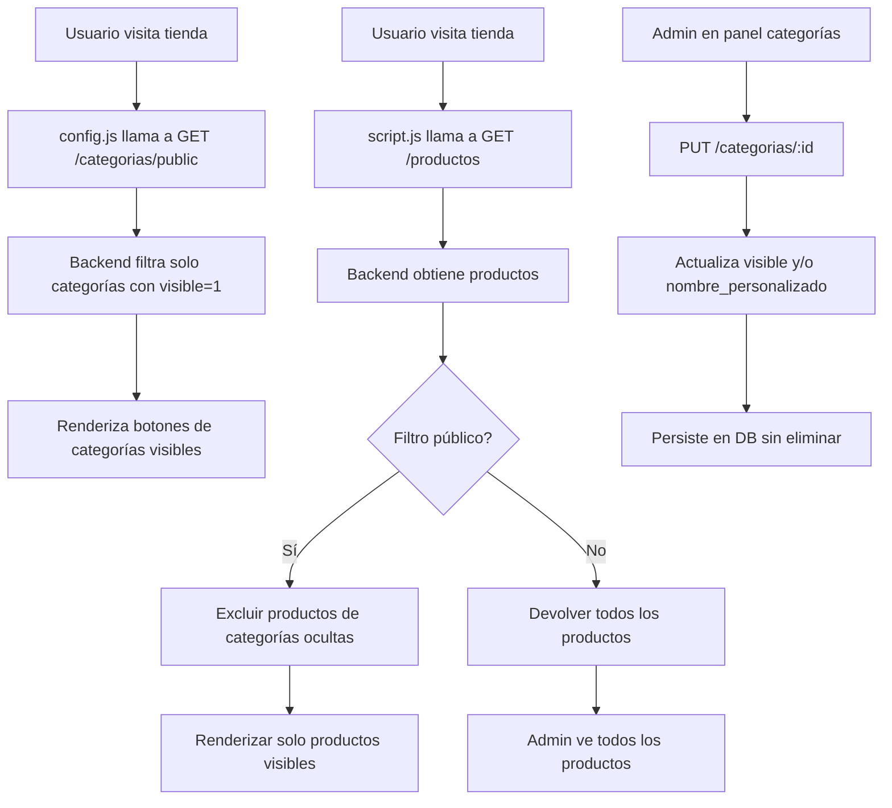
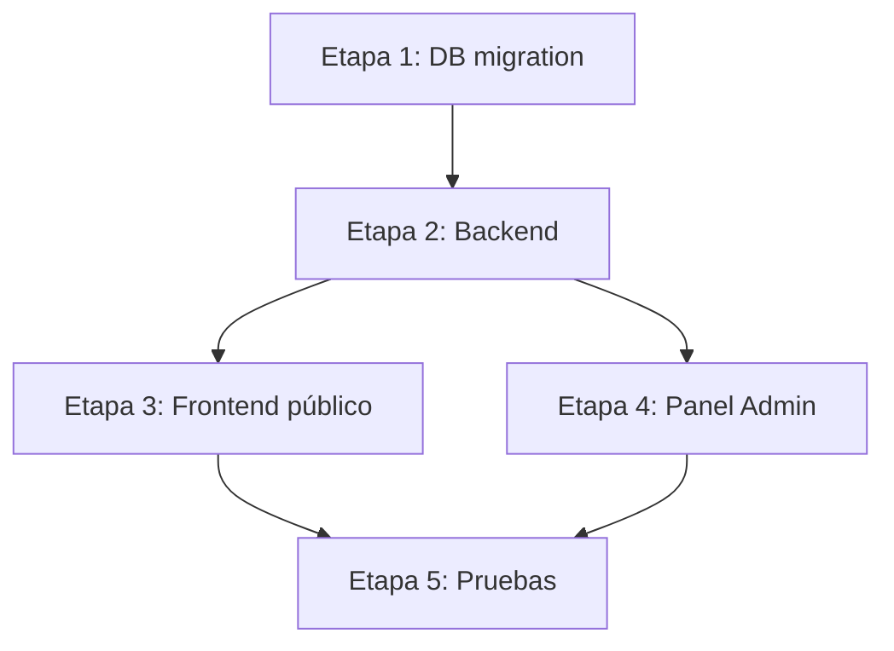

# FASE 2 — Personalización Segura de Categorías (Plan Técnico)

## Índice

1. [Resumen Ejecutivo](#1-resumen-ejecutivo)
2. [Estrategia de Compatibilidad](#2-estrategia-de-compatibilidad)
3. [Cambios en Base de Datos](#3-cambios-en-base-de-datos)
4. [Backend: Controlador y Rutas](#4-backend-controlador-y-rutas)
5. [Frontend Público](#5-frontend-público)
6. [Panel Admin](#6-panel-admin)
7. [Plan de Implementación](#7-plan-de-implementación)
8. [Riesgos y Precauciones](#8-riesgos-y-precaución)

---

## 1. RESUMEN EJECUTIVO

### 1.1 Objetivo

Agregar una capa de personalización sobre las categorías existentes que permita:

- **Renombrar** categorías (sin perder la relación `categoria_id` en productos)
- **Ocultar/mostrar** categorías en la tienda pública
- **Ocultar automáticamente** todos los productos de una categoría oculta
- **NO eliminar** categorías físicamente
- **NO romper** pedidos históricos, dashboard, admin, carrito, APIs existentes

### 1.2 Principio de diseño

> **Mínima invasión, máxima compatibilidad.**

No se modifica la estructura existente de la tabla `categorias`. En su lugar, se **extiende** con columnas adicionales que tienen valores por defecto compatibles con el comportamiento actual.

---

## 2. ESTRATEGIA DE COMPATIBILIDAD

### 2.1 Lo que NO cambia

| Elemento | Estado |
|----------|--------|
| Tabla `categorias` existente | Se extiende con `ALTER TABLE ADD COLUMN`, no se recrea |
| Columna `categorias.id` | NO se modifica |
| Columna `categorias.nombre` | Se mantiene, se agrega `nombre_personalizado` como override opcional |
| Columna `productos.categoria_id` | NO se modifica |
| Tabla `pedidos` | NO se toca |
| Tabla `pedido_items` | NO se toca |
| Tabla `productos` | NO se toca |
| Endpoint `GET /categorias` (actual) | Sigue devolviendo TODAS las categorías (para admin) |
| Endpoint `GET /productos` (actual) | Sigue devolviendo TODOS los productos (para admin) |
| Función `filtrarCategoria(id)` | NO se modifica |
| Función `renderizarProductos()` | NO se modifica |
| Carrito (`localStorage`) | NO se modifica |
| Dashboard | NO se modifica |

### 2.2 Lo que se agrega

| Elemento | Descripción |
|----------|-------------|
| Columna `categorias.visible` | `INTEGER DEFAULT 1` — 1=visible, 0=oculta |
| Columna `categorias.nombre_personalizado` | `TEXT DEFAULT NULL` — si tiene valor, reemplaza a `nombre` en frontend |
| Endpoint `GET /categorias/public` | Devuelve solo categorías visibles (para frontend público) |
| Endpoint `PUT /categorias/:id` | Actualiza nombre_personalizado y/o visible (admin) |
| Página `admin/categorias.html` | Panel de gestión de categorías |
| Función `renderizarCategorias()` modificada | Usa `/categorias/public` en lugar de `/categorias` |
| Filtro en `getProductos` público | Excluye productos de categorías ocultas |

### 2.3 Diagrama de flujo



---

## 3. CAMBIOS EN BASE DE DATOS

### 3.1 Migración de tabla `categorias`

En [`database/db.js`](database/db.js), se agregan las columnas nuevas con `ALTER TABLE`:

```sql
ALTER TABLE categorias ADD COLUMN visible INTEGER DEFAULT 1;
ALTER TABLE categorias ADD COLUMN nombre_personalizado TEXT DEFAULT NULL;
```

**Importante:** `ALTER TABLE ADD COLUMN` en SQLite solo permite agregar columnas al final. No afecta datos existentes. Las filas existentes obtendrán `visible=1` y `nombre_personalizado=NULL` automáticamente.

### 3.2 Código en db.js

Se agrega al final del archivo [`database/db.js`](database/db.js), después de la creación de tablas:

```js
// ============================================
// MIGRACIÓN: Personalización de categorías (FASE 2)
// ============================================
try {
    db.exec(`ALTER TABLE categorias ADD COLUMN visible INTEGER DEFAULT 1`);
} catch (e) {
    // La columna ya existe, ignorar error
}
try {
    db.exec(`ALTER TABLE categorias ADD COLUMN nombre_personalizado TEXT DEFAULT NULL`);
} catch (e) {
    // La columna ya existe, ignorar error
}
```

**¿Por qué try/catch?** SQLite no soporta `IF NOT EXISTS` para `ALTER TABLE ADD COLUMN`. Si la columna ya existe, lanza un error que debemos ignorar silenciosamente.

### 3.3 Datos existentes

| id | nombre | visible | nombre_personalizado |
|----|--------|---------|---------------------|
| 1 | Ropa | 1 | NULL |
| 2 | Calzado | 1 | NULL |
| 3 | Accesorios | 1 | NULL |

Todas las categorías existentes arrancan como **visibles** y **sin nombre personalizado**, lo que significa que el comportamiento actual no cambia en absoluto.

---

## 4. BACKEND: CONTROLADOR Y RUTAS

### 4.1 Modificaciones a [`controllers/categoriaController.js`](controllers/categoriaController.js)

#### 4.1.1 `getCategoriasPublic` (NUEVO)

```js
exports.getCategoriasPublic = (req, res) => {
    try {
        const rows = db.prepare(`
            SELECT id, 
                   COALESCE(nombre_personalizado, nombre) as nombre,
                   visible
            FROM categorias 
            WHERE visible = 1
        `).all();
        res.json(rows);
    } catch (err) {
        console.error('Error al obtener categorías públicas:', err.message);
        res.status(500).json({ error: 'Error al obtener categorías' });
    }
};
```

**¿Por qué `COALESCE`?** Si `nombre_personalizado` es NULL, se usa el `nombre` original. Esto garantiza que categorías sin personalizar sigan mostrando su nombre original.

#### 4.1.2 `getCategorias` (MODIFICADO)

Se modifica para devolver también los nuevos campos:

```js
exports.getCategorias = (req, res) => {
    try {
        const rows = db.prepare('SELECT * FROM categorias').all();
        res.json(rows);
    } catch (err) {
        console.error('Error al obtener categorías:', err.message);
        res.status(500).json({ error: 'Error al obtener categorías' });
    }
};
```

Esto ahora devolverá también `visible` y `nombre_personalizado` para que el admin pueda ver el estado actual.

#### 4.1.3 `actualizarCategoria` (NUEVO)

```js
exports.actualizarCategoria = (req, res) => {
    const id = req.params.id;
    const { nombre_personalizado, visible } = req.body;

    try {
        // Validar que la categoría existe
        const existente = db.prepare('SELECT * FROM categorias WHERE id = ?').get(id);
        if (!existente) {
            return res.status(404).json({ error: 'Categoría no encontrada' });
        }

        // Construir UPDATE dinámico solo con los campos enviados
        const updates = [];
        const params = [];

        if (nombre_personalizado !== undefined) {
            updates.push('nombre_personalizado = ?');
            params.push(nombre_personalizado === '' ? null : nombre_personalizado);
        }

        if (visible !== undefined) {
            updates.push('visible = ?');
            params.push(visible ? 1 : 0);
        }

        if (updates.length === 0) {
            return res.status(400).json({ error: 'No hay campos para actualizar' });
        }

        params.push(id);
        db.prepare(`UPDATE categorias SET ${updates.join(', ')} WHERE id = ?`).run(...params);

        res.json({ ok: true });
    } catch (err) {
        console.error('Error al actualizar categoría:', err.message);
        res.status(500).json({ error: 'Error al actualizar categoría' });
    }
};
```

**¿Por qué UPDATE dinámico?** Para que el frontend pueda enviar solo los campos que cambiaron (solo visible, solo nombre, o ambos).

#### 4.1.4 `getProductosPublic` (NUEVO en productController)

Se agrega un nuevo endpoint que devuelve solo productos de categorías visibles:

```js
exports.getProductosPublic = (req, res) => {
    try {
        const rows = db.prepare(`
            SELECT productos.*, 
                   COALESCE(categorias.nombre_personalizado, categorias.nombre) as categoria
            FROM productos
            LEFT JOIN categorias ON categorias.id = productos.categoria_id
            WHERE categorias.visible = 1 OR productos.categoria_id IS NULL
            ORDER BY productos.id DESC
        `).all();

        const productos = rows.map(p => {
            try {
                p.imagenes = JSON.parse(p.imagenes || '[]');
            } catch(e) {
                p.imagenes = [];
            }
            return p;
        });
        res.json(productos);
    } catch (err) {
        console.error('Error al obtener productos públicos:', err.message);
        res.status(500).json({ error: 'Error al obtener productos' });
    }
};
```

**Importante:** `WHERE categorias.visible = 1 OR productos.categoria_id IS NULL` — los productos sin categoría asignada también se muestran.

### 4.2 Modificaciones a [`routes/categoriaRoutes.js`](routes/categoriaRoutes.js)

```js
// GET público - solo categorías visibles (para frontend tienda)
router.get('/public', categoriaController.getCategoriasPublic);

// GET público (sin auth) - para admin (todas las categorías)
router.get('/', categoriaController.getCategorias);

// PUT requiere autenticación (admin)
router.put('/:id', authMiddleware, categoriaController.actualizarCategoria);

// POST y DELETE existentes se mantienen
router.post('/', authMiddleware, categoriaController.crearCategoria);
router.delete('/:id', authMiddleware, categoriaController.eliminarCategoria);
```

**Orden de rutas:** La ruta `/public` debe definirse ANTES de `/:id` para que Express no interprete "public" como un ID.

### 4.3 Modificaciones a [`routes/productRoutes.js`](routes/productRoutes.js)

Se agrega un nuevo endpoint público:

```js
// GET público - solo productos de categorías visibles
router.get('/public', productController.getProductosPublic);

// GET existente - todos los productos (para admin)
router.get('/', productController.getProductos);
```

### 4.4 Resumen de endpoints

| Método | Ruta | Auth | Uso | Descripción |
|--------|------|------|-----|-------------|
| `GET` | `/categorias` | No | Admin | Todas las categorías (incluye visible, nombre_personalizado) |
| `GET` | `/categorias/public` | No | Frontend | Solo categorías visibles, con nombre personalizado si aplica |
| `PUT` | `/categorias/:id` | Sí | Admin | Actualizar visible y/o nombre_personalizado |
| `POST` | `/categorias` | Sí | Admin | Crear categoría (existente, sin cambios) |
| `DELETE` | `/categorias/:id` | Sí | Admin | Eliminar categoría (existente, sin cambios) |
| `GET` | `/productos` | No | Admin | Todos los productos (existente, sin cambios) |
| `GET` | `/productos/public` | No | Frontend | Solo productos de categorías visibles |

---

## 5. FRONTEND PÚBLICO

### 5.1 Modificaciones a [`public/js/config.js`](public/js/config.js)

La función `renderizarCategorias()` actualmente usa `GET /categorias`. Se cambia a `GET /categorias/public`:

```js
async function renderizarCategorias() {
    const contenedor = document.getElementById('categorias');
    if (!contenedor) return;

    try {
        const respuesta = await fetch('/categorias/public');
        // ... resto igual
    }
}
```

**¿Por qué?** El endpoint `/categorias/public` ya devuelve solo las categorías con `visible=1` y aplica `COALESCE` para el nombre.

### 5.2 Modificaciones a [`public/js/script.js`](public/js/script.js)

La función `cargarProductos()` actualmente usa `GET /productos`. Se cambia a `GET /productos/public`:

```js
async function cargarProductos() {
    mostrarSkeleton();

    const respuesta = await fetch('/productos/public');
    const productos = await respuesta.json();

    productosGlobal = productos;
    renderizarProductos(productos);
    actualizarContador();
    actualizarPreviewCarrito();
}
```

**¿Por qué?** El endpoint `/productos/public` ya excluye productos de categorías ocultas.

### 5.3 Comportamiento esperado

| Escenario | Resultado |
|-----------|-----------|
| Categoría visible | Aparece botón en frontend, sus productos se muestran |
| Categoría oculta | NO aparece botón, NO aparecen sus productos |
| Producto sin categoría | Se muestra (categoria_id IS NULL) |
| Admin ve productos | Usa `/productos` (todos) — sin cambios |
| Admin ve categorías | Usa `/categorias` (todas) — sin cambios |
| Pedido histórico | Los productos en pedido_items tienen nombre y precio guardados, no dependen de categoría |

---

## 6. PANEL ADMIN

### 6.1 Nueva página: [`public/admin/categorias.html`](public/admin/categorias.html)

Página con el mismo layout del admin (sidebar unificado) que contiene:

```
+---------------------------------------------+
|  Panel Admin                                 |
+---------------------------------------------+
|  [📊 Dashboard] [📦 Productos]              |
|  [🛒 Pedidos] [🏷️ Categorías] [🎨 Personalizar] |
+---------------------------------------------+
|                                               |
|  +-- GESTIÓN DE CATEGORÍAS ----------------+ |
|  |                                           | |
|  |  +-- Ropa -----------------------------+ | |
|  |  | Nombre personalizado: [___________] | | |
|  |  | Visible: [🔘 Sí / ○ No]            | | |
|  |  | Productos vinculados: 5             | | |
|  |  | [💾 Guardar]                       | | |
|  |  +-------------------------------------+ | |
|  |                                           | |
|  |  +-- Calzado --------------------------+ | |
|  |  | Nombre personalizado: [___________] | | |
|  |  | Visible: [🔘 Sí / ○ No]            | | |
|  |  | Productos vinculados: 3             | | |
|  |  | [💾 Guardar]                       | | |
|  |  +-------------------------------------+ | |
|  |                                           | |
|  +-------------------------------------------+ |
+---------------------------------------------+
```

### 6.2 Funcionalidades del panel

1. **Listar todas las categorías** con su estado actual
2. **Editar nombre personalizado** (input text, opcional)
3. **Toggle de visibilidad** (switch Sí/No)
4. **Mostrar cantidad de productos vinculados** a cada categoría
5. **Guardar cambios** individualmente por categoría

### 6.3 JS del panel: [`public/js/admin-categorias.js`](public/js/admin-categorias.js)

```js
async function cargarCategoriasAdmin() {
    const respuesta = await fetch('/categorias');
    const categorias = await respuesta.json();
    renderizarCategoriasAdmin(categorias);
}

function renderizarCategoriasAdmin(categorias) {
    const contenedor = document.getElementById('listaCategorias');
    contenedor.innerHTML = categorias.map(cat => `
        <div class="categoria-card" data-id="${cat.id}">
            <div class="categoria-header">
                <h3>${cat.nombre}</h3>
                <span class="categoria-count">${cat.product_count || 0} producto(s)</span>
            </div>
            <div class="categoria-body">
                <div class="campo">
                    <label>Nombre personalizado (opcional)</label>
                    <input type="text" 
                           class="input-nombre" 
                           value="${cat.nombre_personalizado || ''}" 
                           placeholder="${cat.nombre}">
                </div>
                <div class="campo-toggle">
                    <label>Visible en tienda</label>
                    <label class="switch">
                        <input type="checkbox" 
                               class="input-visible" 
                               ${cat.visible ? 'checked' : ''}>
                        <span class="toggle-slider"></span>
                    </label>
                    <span class="toggle-label">${cat.visible ? 'Visible' : 'Oculta'}</span>
                </div>
            </div>
            <div class="categoria-footer">
                <button onclick="guardarCategoria(${cat.id})" class="btn-guardar">
                    💾 Guardar cambios
                </button>
            </div>
        </div>
    `).join('');
}

async function guardarCategoria(id) {
    const card = document.querySelector(`.categoria-card[data-id="${id}"]`);
    const nombre = card.querySelector('.input-nombre').value.trim();
    const visible = card.querySelector('.input-visible').checked;

    const body = {};
    if (nombre) body.nombre_personalizado = nombre;
    else body.nombre_personalizado = ''; // Envía string vacío para resetear a NULL

    body.visible = visible;

    try {
        const respuesta = await fetch(`/categorias/${id}`, {
            method: 'PUT',
            headers: { 'Content-Type': 'application/json' },
            body: JSON.stringify(body)
        });

        if (!respuesta.ok) throw new Error('Error al guardar');

        mostrarToast('✓ Categoría actualizada', 'success');
        await cargarCategoriasAdmin();
    } catch (err) {
        mostrarToast('Error al guardar categoría', 'error');
    }
}
```

### 6.4 Modificaciones al sidebar

Se agrega el link a "Categorías" en TODAS las páginas admin:

- [`public/admin/admin.html`](public/admin/admin.html)
- [`public/admin/dashboard.html`](public/admin/dashboard.html)
- [`public/admin/pedidos.html`](public/admin/pedidos.html)
- [`public/admin/personalizacion.html`](public/admin/personalizacion.html)

```html
<a href="/admin/categorias.html">
    🏷️ Categorías
</a>
```

---

## 7. PLAN DE IMPLEMENTACIÓN

### Etapa 1: Base de datos (dependencia 0)

| # | Tarea | Archivos | Descripción |
|---|-------|----------|-------------|
| 1.1 | Agregar columnas `visible` y `nombre_personalizado` | [`database/db.js`](database/db.js) | Dos `ALTER TABLE ADD COLUMN` con try/catch para ignorar si ya existen |

### Etapa 2: Backend (dependencia: etapa 1)

| # | Tarea | Archivos | Descripción |
|---|-------|----------|-------------|
| 2.1 | Agregar `getCategoriasPublic` | [`controllers/categoriaController.js`](controllers/categoriaController.js) | SELECT con WHERE visible=1 y COALESCE para nombre |
| 2.2 | Modificar `getCategorias` | [`controllers/categoriaController.js`](controllers/categoriaController.js) | Cambiar a `SELECT *` para incluir nuevos campos |
| 2.3 | Agregar `actualizarCategoria` | [`controllers/categoriaController.js`](controllers/categoriaController.js) | UPDATE dinámico según campos recibidos |
| 2.4 | Agregar `getProductosPublic` | [`controllers/productController.js`](controllers/productController.js) | JOIN con categorías, WHERE visible=1 |
| 2.5 | Agregar rutas públicas | [`routes/categoriaRoutes.js`](routes/categoriaRoutes.js) | GET /public, PUT /:id |
| 2.6 | Agregar ruta productos públicos | [`routes/productRoutes.js`](routes/productRoutes.js) | GET /public |

### Etapa 3: Frontend público (dependencia: etapa 2)

| # | Tarea | Archivos | Descripción |
|---|-------|----------|-------------|
| 3.1 | Cambiar `renderizarCategorias` a `/categorias/public` | [`public/js/config.js`](public/js/config.js) | Reemplazar fetch URL |
| 3.2 | Cambiar `cargarProductos` a `/productos/public` | [`public/js/script.js`](public/js/script.js) | Reemplazar fetch URL |

### Etapa 4: Panel Admin (dependencia: etapa 2)

| # | Tarea | Archivos | Descripción |
|---|-------|----------|-------------|
| 4.1 | Crear [`public/admin/categorias.html`](public/admin/categorias.html) | Nuevo archivo | Página con sidebar, lista de categorías, formularios |
| 4.2 | Crear [`public/js/admin-categorias.js`](public/js/admin-categorias.js) | Nuevo archivo | Lógica de carga, renderizado, guardado |
| 4.3 | Agregar estilos en [`admin.css`](public/css/admin.css) | `public/css/admin.css` | Estilos para tarjetas de categoría, toggle switch |
| 4.4 | Agregar link en sidebar de admin.html | `public/admin/admin.html` | Link a categorías |
| 4.5 | Agregar link en sidebar de dashboard.html | `public/admin/dashboard.html` | Link a categorías |
| 4.6 | Agregar link en sidebar de pedidos.html | `public/admin/pedidos.html` | Link a categorías |
| 4.7 | Agregar link en sidebar de personalizacion.html | `public/admin/personalizacion.html` | Link a categorías |

### Etapa 5: Pruebas (dependencia: todas)

| # | Tarea | Descripción |
|---|-------|-------------|
| 5.1 | Verificar que categorías existentes siguen visibles | Sin migración, todo debe funcionar igual |
| 5.2 | Ocultar una categoría y verificar que desaparece del frontend | Botón + productos no deben aparecer |
| 5.3 | Verificar que admin sigue viendo todas las categorías | Dashboard y admin de productos sin cambios |
| 5.4 | Personalizar nombre de categoría | Verificar que se muestra el nuevo nombre en frontend |
| 5.5 | Verificar pedidos históricos | Los productos en pedidos no dependen de categorías |
| 5.6 | Verificar carrito | Productos en localStorage no se ven afectados |
| 5.7 | Volver a mostrar categoría oculta | Debe restaurarse sin pérdida de datos |

### Diagrama de dependencias



---

## 8. RIESGOS Y PRECAUCIONES

### 8.1 Qué podría romperse

| Riesgo | Probabilidad | Mitigación |
|--------|-------------|------------|
| **ALTER TABLE falla en SQLite** | Baja | try/catch alrededor de cada ALTER TABLE |
| **Productos huérfanos (categoria_id=NULL)** | Baja | El WHERE incluye `OR categoria_id IS NULL` |
| **Admin no ve productos de categorías ocultas** | Media | El admin usa `/productos` (sin filtro), no `/productos/public` |
| **Sidebar inconsistente** | Media | El link de categorías debe agregarse en TODAS las páginas admin |
| **El frontend usa endpoint incorrecto** | Baja | Solo se cambian 2 URLs en config.js y script.js |
| **nombre_personalizado vacío vs NULL** | Baja | En backend, string vacío se convierte a NULL |

### 8.2 Lo que debe evitarse

- **NO** eliminar la columna `nombre` de `categorias`
- **NO** cambiar IDs de categorías existentes
- **NO** modificar la función `filtrarCategoria(id)` — sigue funcionando con IDs
- **NO** modificar `renderizarProductos()` — solo cambia el fetch de datos
- **NO** tocar `pedidos`, `pedido_items`, `usuarios`
- **NO** modificar el carrito (localStorage)
- **NO** introducir dependencias externas nuevas

### 8.3 Rollback plan

Si algo sale mal:

1. **Revertir cambios en db.js**: Eliminar los dos `ALTER TABLE` (o dejarlos, no dañan)
2. **Revertir cambios en categoriaController.js**: Volver a la versión original
3. **Revertir cambios en productController.js**: Volver a la versión original
4. **Revertir cambios en routes**: Volver a la versión original
5. **Revertir cambios en config.js y script.js**: Volver a usar `/categorias` y `/productos`
6. **Eliminar admin/categorias.html y admin-categorias.js**: Archivos nuevos, se borran sin impacto

**Nota:** Las columnas `visible` y `nombre_personalizado` agregadas por ALTER TABLE no afectan negativamente si se dejan. SQLite no tiene costo por columnas adicionales no utilizadas.
