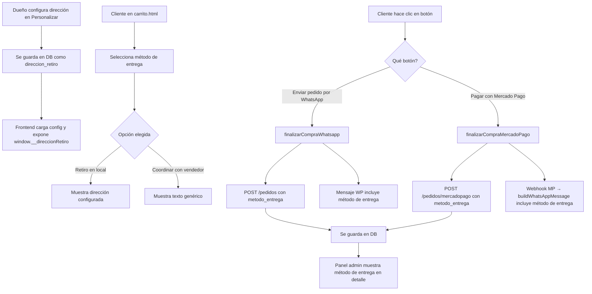

# Plan: Método de Entrega en el Carrito

## Resumen

Agregar un selector de método de entrega (radio buttons) en la página del carrito, justo después del total. El dueño de la tienda podrá configurar la dirección del local desde el panel de personalización. El método de entrega seleccionado se incluirá en el mensaje de WhatsApp (tanto para pedidos directos como para comprobantes post-Mercado Pago) y se guardará en la base de datos.

---

## 1. Base de datos - Migración

### 1.1 Nueva columna en tabla `pedidos`

Agregar columna `metodo_entrega` en [`database/db.js`](database/db.js) (después de la línea 123, junto a las otras migraciones de pedidos):

```sql
ALTER TABLE pedidos ADD COLUMN metodo_entrega TEXT DEFAULT 'retiro_local'
```

### 1.2 Nueva clave de configuración `direccion_retiro`

Se agregará automáticamente como las demás migraciones de configuración en [`database/db.js`](database/db.js). Clave: `direccion_retiro`, valor: texto vacío por defecto, grupo: `'whatsapp'`.

---

## 2. Panel Admin - Personalización

### 2.1 Agregar etiqueta y grupo

En [`public/admin/personalizacion.html`](public/admin/personalizacion.html):

- Agregar en `etiquetas`: `direccion_retiro: 'Dirección del local para retiro'`
- Agregar en `grupos`: `direccion_retiro: 'whatsapp'`
- Agregar en `textosDefault`: `direccion_retiro: ''`

Esto hará que aparezca automáticamente en la sección "WhatsApp Importante" como un campo de texto más, justo debajo del número de WhatsApp.

---

## 3. Frontend - Carrito (store-payment-toggle.js)

### 3.1 Guardar dirección en variable global

En [`public/js/config.js`](public/js/config.js), función `aplicarConfiguracion()`, agregar:

```js
if (config.direccion_retiro) {
    window.__direccionRetiro = config.direccion_retiro;
}
```

### 3.2 Agregar radio buttons en carrito.html

En [`public/carrito.html`](public/carrito.html), después del `resumen-total` (línea 84) y antes del contenedor `botones-checkout` (línea 126), insertar:

```html
<div class="resumen-entrega" id="resumenEntrega">
    <h3>Metodo de entrega</h3>
    <label class="entrega-option">
        <input type="radio" name="metodo_entrega" value="retiro_local" checked>
        <span class="entrega-label">Retiro en local</span>
        <span class="entrega-direccion" id="direccionRetiro"></span>
    </label>
    <label class="entrega-option">
        <input type="radio" name="metodo_entrega" value="coordinar">
        <span class="entrega-label">Coordinar con el vendedor</span>
    </label>
</div>
```

### 3.3 Actualizar función para obtener método de entrega

En [`public/js/store-payment-toggle.js`](public/js/store-payment-toggle.js), crear función:

```js
function getMetodoEntrega() {
    var seleccionado = document.querySelector('input[name="metodo_entrega"]:checked');
    if (!seleccionado) return 'retiro_local';
    return seleccionado.value;
}

function getTextoEntrega() {
    var metodo = getMetodoEntrega();
    if (metodo === 'retiro_local') {
        var direccion = window.__direccionRetiro || '';
        return direccion ? 'Retiro en local - ' + direccion : 'Retiro en local';
    }
    return 'Coordinar con el vendedor';
}
```

### 3.4 Incluir método de entrega en mensajes WhatsApp

#### a) En `calcularTotalYMensaje()` (línea 51)
Agregar al final del mensaje:

```js
mensaje += '%0A📦 Metodo de entrega: ' + getTextoEntrega();
```

#### b) En `buildMensajePagoExitoso()` (línea 74)
Agregar después de la línea del total:

```js
mensaje += '\n' + '  Metodo de entrega: ' + getTextoEntrega() + '\n';
```

#### c) En `buildWhatsAppMessage()` en [`controllers/mercadopagoController.js`](controllers/mercadopagoController.js) (línea 637)
Agregar después de la línea del total, tanto en `mensajeCliente` como en `mensajeDueno`:

```js
'  Metodo de entrega: ' + (pedido.metodo_entrega || 'Retiro en local') + '\n' +
```

### 3.5 Enviar método de entrega al backend

#### a) En `finalizarCompraWhatsapp()` (línea 256)
Agregar `metodo_entrega` al body del POST:

```js
body: JSON.stringify({
    cliente: datos.cliente,
    telefono: datos.telefono,
    productos: carrito,
    total: total,
    metodo_entrega: getMetodoEntrega(),
}),
```

#### b) En `finalizarCompraMercadoPago()` (línea 311)
Agregar `metodo_entrega` al body del POST:

```js
body: JSON.stringify({
    cliente: datos.cliente,
    telefono: datos.telefono,
    productos: carrito,
    total: total,
    slug: slug,
    metodo_entrega: getMetodoEntrega(),
}),
```

---

## 4. Backend - Controladores

### 4.1 En [`controllers/pedidoController.js`](controllers/pedidoController.js) - `crearPedido()`

- Extraer `metodo_entrega` del `req.body` (con default `'retiro_local'`)
- Incluir en el INSERT:

```sql
INSERT INTO pedidos (cliente, telefono, total, estado, fecha, tienda_id, metodo_entrega)
VALUES (?, ?, ?, ?, ?, ?, ?)
```

### 4.2 En [`controllers/mercadopagoController.js`](controllers/mercadopagoController.js) - `crearPreferenciaDesdePedido()`

- Extraer `metodo_entrega` del `req.body`
- Incluir en el INSERT de la transacción `insertPedido`

### 4.3 En `getPedidoStatus()` de [`controllers/mercadopagoController.js`](controllers/mercadopagoController.js)

- Incluir `metodo_entrega` en la respuesta del pedido (para que el frontend lo use en `buildMensajePagoExitoso`)

---

## 5. Panel Admin - Detalle de pedido

### 5.1 En [`public/js/pedidos.js`](public/js/pedidos.js)

Agregar en la sección de detalles del pedido (después del total, línea 218):

```js
<div class="pedido-detalle">
    <strong>Metodo de entrega:</strong> ${pedido.metodo_entrega === 'retiro_local' ? 'Retiro en local' : 'Coordinar con el vendedor'}
</div>
```

---

## 6. CSS - Estilos

### 6.1 En [`public/css/store.css`](public/css/store.css)

Agregar estilos para `.resumen-entrega`, `.entrega-option`, `.entrega-label`, `.entrega-direccion`:

```css
.resumen-entrega {
    margin-top: 20px;
    padding-top: 16px;
    border-top: 1px solid #e5e7eb;
}

.resumen-entrega h3 {
    font-size: 15px;
    font-weight: 600;
    margin-bottom: 12px;
    color: #374151;
}

.entrega-option {
    display: flex;
    align-items: flex-start;
    gap: 10px;
    padding: 10px 12px;
    border: 1px solid #e5e7eb;
    border-radius: 8px;
    margin-bottom: 8px;
    cursor: pointer;
    transition: border-color 0.2s, background 0.2s;
}

.entrega-option:hover {
    border-color: var(--color-boton);
    background: rgba(0,0,0,0.02);
}

.entrega-option input[type="radio"] {
    margin-top: 3px;
    accent-color: var(--color-boton);
}

.entrega-label {
    font-weight: 500;
    font-size: 14px;
    color: #1f2937;
}

.entrega-direccion {
    display: block;
    font-size: 13px;
    color: #6b7280;
    margin-top: 2px;
}
```

---

## Diagrama de flujo



---

## Archivos a modificar (resumen)

| Archivo | Cambio |
|---------|--------|
| [`database/db.js`](database/db.js) | Migración: columna `metodo_entrega` en pedidos + clave `direccion_retiro` en config |
| [`public/admin/personalizacion.html`](public/admin/personalizacion.html) | Agregar etiqueta, grupo y default para `direccion_retiro` |
| [`public/js/config.js`](public/js/config.js) | Guardar `window.__direccionRetiro` |
| [`public/carrito.html`](public/carrito.html) | Agregar radio buttons de método de entrega |
| [`public/js/store-payment-toggle.js`](public/js/store-payment-toggle.js) | Funciones `getMetodoEntrega/getTextoEntrega`, incluirlas en mensajes y en POST |
| [`controllers/pedidoController.js`](controllers/pedidoController.js) | Guardar `metodo_entrega` en INSERT |
| [`controllers/mercadopagoController.js`](controllers/mercadopagoController.js) | Guardar `metodo_entrega` en INSERT + incluirlo en `buildWhatsAppMessage` + en `getPedidoStatus` |
| [`public/js/pedidos.js`](public/js/pedidos.js) | Mostrar método de entrega en detalle del pedido |
| [`public/css/store.css`](public/css/store.css) | Estilos para los radio buttons de entrega |
