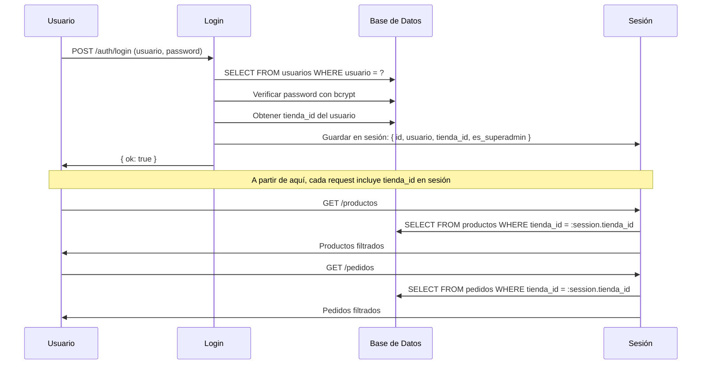
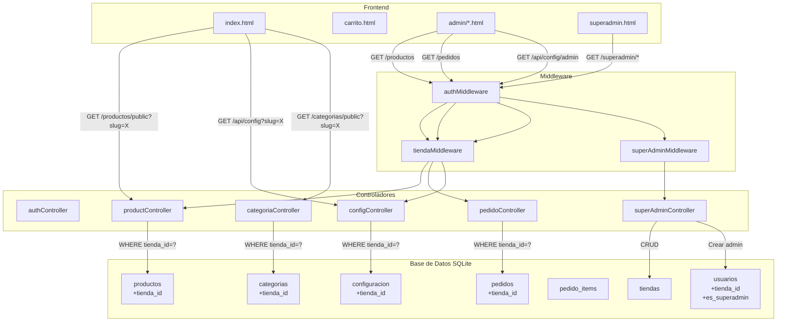

# Plan de Migración Multi-Tenant (Multi-Tienda)

## 1. ANÁLISIS DE LA ESTRUCTURA ACTUAL

### Base de Datos (SQLite - better-sqlite3)

| Tabla | Columnas | ¿Tiene tienda_id? |
|-------|----------|-------------------|
| `usuarios` | id, usuario, password | ❌ No |
| `categorias` | id, nombre, visible, nombre_personalizado | ❌ No |
| `productos` | id, nombre, precio, descripcion, imagenes, stock, categoria_id, nuevo, descuento | ❌ No |
| `pedidos` | id, cliente, telefono, total, estado, fecha | ❌ No |
| `pedido_items` | id, pedido_id, producto_id, nombre, cantidad, precio | ❌ No |
| `configuracion` | clave, valor, tipo, grupo | ❌ No |

### Backend (Node.js + Express)

| Archivo | Rol | ¿Afectado? |
|---------|-----|------------|
| `database/db.js` | Esquema BD + migraciones | ✅ Sí - Agregar tabla tiendas + columnas |
| `database/createAdmin.js` | Crear admin inicial | ✅ Sí - Asociar a tienda |
| `middleware/authMiddleware.js` | Verificar sesión | ✅ Sí - Detectar tienda_id |
| `controllers/authController.js` | Login/Logout | ✅ Sí - Filtrar por tienda |
| `controllers/productController.js` | CRUD productos | ✅ Sí - Filtrar por tienda_id |
| `controllers/pedidoController.js` | CRUD pedidos | ✅ Sí - Filtrar por tienda_id |
| `controllers/categoriaController.js` | CRUD categorías | ✅ Sí - Filtrar por tienda_id |
| `controllers/configController.js` | Configuración tienda | ✅ Sí - Filtrar por tienda_id |
| `server.js` | Entry point + rutas | ✅ Sí - Agregar ruta superadmin |
| `routes/*.js` | Definición de rutas | ❌ No - Solo reutilizan controladores |

### Frontend (HTML + JS vanilla)

| Archivo | ¿Afectado? |
|---------|------------|
| `public/index.html` | ❌ No - Sigue igual |
| `public/carrito.html` | ❌ No - Sigue igual |
| `public/js/script.js` | ❌ No - Sigue igual |
| `public/js/carrito.js` | ❌ No - Sigue igual |
| `public/js/config.js` | ❌ No - Sigue igual |
| `public/admin/login.html` | ❌ No - Sigue igual |
| `public/admin/admin.html` | ❌ No - Sigue igual |
| `public/admin/dashboard.html` | ❌ No - Sigue igual |
| `public/admin/pedidos.html` | ❌ No - Sigue igual |
| `public/admin/categorias.html` | ❌ No - Sigue igual |
| `public/admin/personalizacion.html` | ❌ No - Sigue igual |
| `public/js/admin.js` | ❌ No - Sigue igual |
| `public/js/dashboard.js` | ❌ No - Sigue igual |
| `public/js/pedidos.js` | ❌ No - Sigue igual |
| `public/js/admin-categorias.js` | ❌ No - Sigue igual |
| `public/js/auth.js` | ❌ No - Sigue igual |

> **Conclusión clave:** El frontend NO necesita cambios porque el backend filtrará automáticamente por `tienda_id` según el admin logueado. El admin de cada tienda solo verá sus datos.

---

## 2. ARQUITECTURA MULTI-TENANT

```
┌─────────────────────────────────────────────────────┐
│                   UNA SOLA APP                       │
│                  shop.yamy.fun                       │
│                                                      │
│  ┌─────────────┐  ┌─────────────┐  ┌─────────────┐  │
│  │  /tienda1   │  │  /tienda2   │  │  /tienda3   │  │
│  │             │  │             │  │             │  │
│  │ Admin t1    │  │ Admin t2    │  │ Admin t3    │  │
│  │ Productos   │  │ Productos   │  │ Productos   │  │
│  │ Pedidos     │  │ Pedidos     │  │ Pedidos     │  │
│  │ Config      │  │ Config      │  │ Config      │  │
│  └─────────────┘  └─────────────┘  └─────────────┘  │
│                                                      │
│  ┌─────────────────────────────────────────────────┐ │
│  │           SUPER ADMIN (solo yo)                  │ │
│  │  - Crear tiendas                                 │ │
│  │  - Activar/Desactivar tiendas                    │ │
│  │  - Resetear passwords                            │ │
│  │  - Ver listado de tiendas                        │ │
│  └─────────────────────────────────────────────────┘ │
└─────────────────────────────────────────────────────┘
```

### Flujo de autenticación multi-tenant



---

## 3. PLAN DE IMPLEMENTACIÓN (PASO A PASO)

### FASE 1: BASE DE DATOS - ESQUEMA

#### 1.1 Crear tabla `tiendas`

```sql
CREATE TABLE IF NOT EXISTS tiendas (
    id INTEGER PRIMARY KEY AUTOINCREMENT,
    nombre TEXT NOT NULL,
    slug TEXT UNIQUE NOT NULL,
    activo INTEGER DEFAULT 1,
    created_at TEXT DEFAULT (datetime('now', '-3 hours'))
);
```

#### 1.2 Agregar columna `tienda_id` a tablas existentes

```sql
-- Migración segura (con try/catch por si ya existe)
ALTER TABLE usuarios ADD COLUMN tienda_id INTEGER DEFAULT 1;
ALTER TABLE productos ADD COLUMN tienda_id INTEGER DEFAULT 1;
ALTER TABLE pedidos ADD COLUMN tienda_id INTEGER DEFAULT 1;
ALTER TABLE categorias ADD COLUMN tienda_id INTEGER DEFAULT 1;
ALTER TABLE configuracion ADD COLUMN tienda_id INTEGER DEFAULT 1;
```

> **CRÍTICO:** `DEFAULT 1` asegura que todos los datos existentes se asignen automáticamente a la tienda por defecto (id=1). No se pierde nada.

#### 1.3 Agregar columna `es_superadmin` a usuarios

```sql
ALTER TABLE usuarios ADD COLUMN es_superadmin INTEGER DEFAULT 0;
```

#### 1.4 Crear tienda por defecto y migrar admin existente

```sql
-- Insertar tienda por defecto si no existe
INSERT OR IGNORE INTO tiendas (id, nombre, slug, activo)
VALUES (1, 'Tienda Principal', 'tienda-principal', 1);

-- Asignar el admin existente a tienda 1 y marcarlo como superadmin
UPDATE usuarios SET tienda_id = 1, es_superadmin = 1 WHERE id = 1;
```

---

### FASE 2: BACKEND - MIDDLEWARE DE TIENDA

#### 2.1 Crear `middleware/tiendaMiddleware.js`

Función: Extraer `tienda_id` de la sesión del usuario logueado y adjuntarlo a `req.tienda_id`.

```javascript
// middleware/tiendaMiddleware.js
function tiendaMiddleware(req, res, next) {
    if (req.session && req.session.user && req.session.user.tienda_id) {
        req.tienda_id = req.session.user.tienda_id;
    } else {
        // Para rutas públicas (sin auth), usar slug de la URL
        const slug = req.query.slug || req.params.slug;
        if (slug) {
            const db = require('../database/db');
            const tienda = db.prepare('SELECT id FROM tiendas WHERE slug = ? AND activo = 1').get(slug);
            if (tienda) {
                req.tienda_id = tienda.id;
            } else {
                req.tienda_id = 1; // fallback a tienda principal
            }
        } else {
            req.tienda_id = 1; // fallback
        }
    }
    next();
}
module.exports = tiendaMiddleware;
```

#### 2.2 Modificar `middleware/authMiddleware.js`

Agregar detección de SUPER ADMIN para rutas especiales.

---

### FASE 3: BACKEND - CONTROLADORES

#### 3.1 Modificar `controllers/authController.js`

- En el login: al obtener el usuario, también obtener su `tienda_id` y `es_superadmin`.
- Guardar en sesión: `{ id, usuario, tienda_id, es_superadmin }`.

#### 3.2 Modificar `controllers/productController.js`

- En TODAS las queries: agregar `WHERE tienda_id = ?` usando `req.tienda_id`.
- En INSERT: agregar `tienda_id` al INSERT.

#### 3.3 Modificar `controllers/pedidoController.js`

- En `getPedidos`: agregar `WHERE tienda_id = ?`.
- En `crearPedido`: agregar `tienda_id` al INSERT.
- En `cambiarEstado` y `eliminarPedido`: verificar que el pedido pertenezca a la tienda.

#### 3.4 Modificar `controllers/categoriaController.js`

- En todas las queries: agregar `WHERE tienda_id = ?`.
- En INSERT: agregar `tienda_id`.

#### 3.5 Modificar `controllers/configController.js`

- En todas las queries: agregar `WHERE tienda_id = ?`.
- En UPDATE: asegurar que solo afecte registros de la tienda actual.

---

### FASE 4: SUPER ADMIN - NUEVAS RUTAS

#### 4.1 Crear `controllers/superAdminController.js`

Funciones:
- `listarTiendas` - GET /superadmin/tiendas
- `crearTienda` - POST /superadmin/tiendas
- `activarTienda` - PUT /superadmin/tiendas/:id/activar
- `desactivarTienda` - PUT /superadmin/tiendas/:id/desactivar
- `crearAdminTienda` - POST /superadmin/tiendas/:id/admin
- `resetearPassword` - PUT /superadmin/tiendas/:id/admin/reset-password

#### 4.2 Crear `routes/superAdminRoutes.js`

Todas las rutas protegidas con middleware que verifique `es_superadmin === true`.

#### 4.3 Crear `middleware/superAdminMiddleware.js`

```javascript
function superAdminMiddleware(req, res, next) {
    if (req.session && req.session.user && req.session.user.es_superadmin) {
        return next();
    }
    res.status(403).json({ error: 'Acceso denegado: se requiere Super Admin' });
}
```

#### 4.4 Crear frontend Super Admin

Crear `public/admin/superadmin.html` con:
- Listado de tiendas
- Botón "Crear tienda"
- Botón "Activar/Desactivar"
- Formulario para crear admin de tienda
- Formulario para resetear password

---

### FASE 5: RUTAS PÚBLICAS - DETECCIÓN DE TIENDA POR SLUG

#### 5.1 Modificar `server.js`

Agregar lógica para detectar el slug desde la URL:

```javascript
// Antes de servir archivos estáticos
app.use((req, res, next) => {
    // Detectar slug en la URL: /tienda1, /tienda2, etc.
    const match = req.path.match(/^\/([^\/]+)/);
    if (match) {
        const slug = match[1];
        const db = require('./database/db');
        const tienda = db.prepare('SELECT id, slug FROM tiendas WHERE slug = ? AND activo = 1').get(slug);
        if (tienda) {
            req.tienda_slug = slug;
            req.tienda_id = tienda.id;
            // Reescribir la URL para servir desde public/
            req.url = req.url.replace('/' + slug, '') || '/';
        }
    }
    next();
});
```

#### 5.2 Rutas públicas con slug

Las rutas públicas (`/productos/public`, `/categorias/public`, `/api/config`) deben aceptar `?slug=xxx` como query param para que el frontend pueda cargar la configuración correcta.

---

### FASE 6: FRONTEND - CONFIGURACIÓN POR TIENDA

#### 6.1 Modificar `public/js/config.js`

- Detectar el slug de la URL actual (ej: `/tienda1/`)
- Pasar `?slug=xxx` al llamar a `/api/config`
- Pasar `?slug=xxx` al llamar a `/categorias/public`
- Pasar `?slug=xxx` al llamar a `/productos/public`

#### 6.2 Modificar `public/js/script.js`

- Al cargar productos, pasar el slug detectado.

---

## 4. RIESGOS Y MITIGACIONES

| Riesgo | Impacto | Mitigación |
|--------|---------|------------|
| Perder datos existentes | 🔴 Alto | Usar `DEFAULT 1` en columnas nuevas. Hacer backup antes. |
| Romper queries existentes | 🔴 Alto | Cada cambio en controladores se prueba individualmente. |
| Que un admin vea datos de otra tienda | 🔴 Alto | El middleware de tienda fuerza el filtro. Nunca confiar en input del cliente. |
| Que el frontend deje de funcionar | 🟡 Medio | El frontend NO se modifica. Solo el backend filtra. |
| Sesiones existentes invalidadas | 🟡 Medio | Al cambiar authController, las sesiones viejas perderán tienda_id. Forzar relogin. |
| Slug duplicado | 🟢 Bajo | La columna slug tiene UNIQUE constraint. |
| Que un admin malicioso acceda a rutas superadmin | 🔴 Alto | El middleware superAdminMiddleware verifica `es_superadmin` en sesión. |

---

## 5. ORDEN DE IMPLEMENTACIÓN

```
PASO 1: Backup de database.db
PASO 2: Modificar database/db.js (nuevas tablas + columnas + migración)
PASO 3: Crear middleware/tiendaMiddleware.js
PASO 4: Modificar middleware/authMiddleware.js
PASO 5: Crear middleware/superAdminMiddleware.js
PASO 6: Modificar controllers/authController.js (tienda_id en sesión)
PASO 7: Modificar controllers/productController.js (filtro tienda_id)
PASO 8: Modificar controllers/pedidoController.js (filtro tienda_id)
PASO 9: Modificar controllers/categoriaController.js (filtro tienda_id)
PASO 10: Modificar controllers/configController.js (filtro tienda_id)
PASO 11: Crear controllers/superAdminController.js
PASO 12: Crear routes/superAdminRoutes.js
PASO 13: Modificar server.js (slug detection + nuevas rutas)
PASO 14: Modificar public/js/config.js (slug en llamadas)
PASO 15: Crear public/admin/superadmin.html
PASO 16: Probar migración con datos existentes
PASO 17: Probar creación de nueva tienda
PASO 18: Probar aislamiento entre tiendas
```

---

## 6. DIAGRAMA DE ARQUITECTURA FINAL



---

## 7. RESUMEN DE ARCHIVOS A MODIFICAR/CREAR

### Archivos a MODIFICAR (14):
1. `database/db.js` - Schema + migración
2. `database/createAdmin.js` - Asociar a tienda
3. `middleware/authMiddleware.js` - No requiere cambios (ya usa sesión)
4. `controllers/authController.js` - Guardar tienda_id en sesión
5. `controllers/productController.js` - Filtrar por tienda_id
6. `controllers/pedidoController.js` - Filtrar por tienda_id
7. `controllers/categoriaController.js` - Filtrar por tienda_id
8. `controllers/configController.js` - Filtrar por tienda_id
9. `server.js` - Slug detection + rutas superadmin
10. `public/js/config.js` - Pasar slug en llamadas
11. `public/js/script.js` - Pasar slug en llamadas de productos

### Archivos a CREAR (5):
1. `middleware/tiendaMiddleware.js`
2. `middleware/superAdminMiddleware.js`
3. `controllers/superAdminController.js`
4. `routes/superAdminRoutes.js`
5. `public/admin/superadmin.html`

### Archivos que NO se modifican (14):
- `public/index.html`, `public/carrito.html`
- `public/admin/admin.html`, `public/admin/dashboard.html`, `public/admin/pedidos.html`, `public/admin/categorias.html`, `public/admin/personalizacion.html`, `public/admin/login.html`
- `public/js/admin.js`, `public/js/dashboard.js`, `public/js/pedidos.js`, `public/js/admin-categorias.js`, `public/js/auth.js`, `public/js/carrito.js`
- `routes/productRoutes.js`, `routes/pedidoRoutes.js`, `routes/categoriaRoutes.js`, `routes/configRoutes.js`, `routes/authRoutes.js`
- `middleware/uploadMiddleware.js`

---

## 8. COMPATIBILIDAD HACIA ATRÁS

- ✅ Todos los datos existentes se migran automáticamente a `tienda_id = 1`
- ✅ El admin existente se convierte en SUPER ADMIN
- ✅ Las URLs actuales siguen funcionando (sin slug = tienda por defecto)
- ✅ El frontend no requiere cambios en su lógica
- ✅ La personalización visual sigue funcionando exactamente igual
- ✅ Los pedidos existentes se mantienen intactos
- ✅ Las categorías existentes se mantienen intactas
